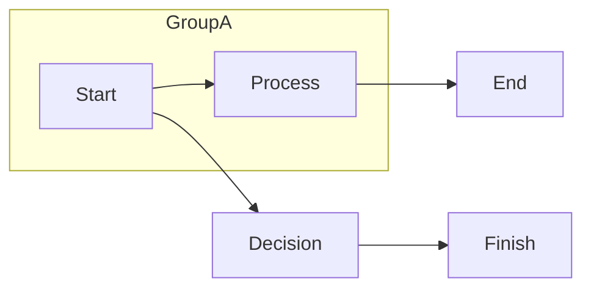

# Flowchart layout validation - Mermaid CLI coordinates

%%{init: {"flowchart": {"useMermaidLayout": true}} }%%

```mermaid
flowchart LR
    subgraph GroupA
        A[Start] --> B[Process]
    end
    B --> C[End]
    A --> D[Decision] --> E[Finish]
```
